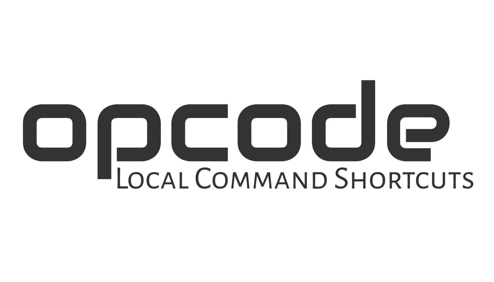

<div align='center'>


# Opcode - Local Command Shortcuts


</div>

---

Opcode lets you define a simple configuration file in any directory.
This file includes shortcuts to other commands.


For a similar project, but for globally accessible aliases, see [alf][alf].


## Install

The simplest way to install, is to run the installation script:

```shell
$ curl -Ls get.dannyb.co/opcode/setup | bash
```

If you prefer to install manually, simply download the [op](/op) file,
place it somewhere in your path, and make it executable.

## Usage

When you execute `op`, Opcode will look for `op.conf` in the current 
directory. See the example [op.conf](op.conf) file for reference.

The syntax of `op.conf` is simple:

Each line should contain a code and the command to run:

```shell
code: command to run
```

For example:

```shell
commit: git commit -am "quick commit"
```

With this configuration, you can now simply run:

```shell
$ op commit
```

Any argument provided to the CLI will be forwarded to the command, so with 
this configuration:

```shell
commit: git commit -am
```

You can supply a commit message:

```shell
$ op commit "my commit message"
```

## Additional Usage Utilities

```
$ op --help

Usage:
  op CODE [ARGS]
    Execute a command from the config file (op.conf)
    Arguments will be passed to the command

  op ?
    Show all codes and their usage comments (#?)

  op -l, --list
    List command codes

  op -s, --show
    Show the config file (op.conf)

  op -w, --what CODE
    Show the command for a given code

  op -e, --edit
    Open the config file for editing

  op -a, --add CODE COMMAND...
    Append a command to the config file

  op -h, --help
    Show this message

  op -v, --version
    Show version number
```


## Positional Arguments

In some cases, you may want to use the command line arguments in different
positions in your command. Given this configuration:

```shell
deploy: git commit -am "$1" && git push
```

You can now run:

```shell
$ op deploy "version 1.1.1"
```

and it will be translated to this command

```shell
git commit -am "version 1.1.1" && git push
```

This is made possible due to the fact that any command that contains a `$`
character, will not have the command line arguments (`$@`) appended to it.

## Usage Comments

You may add special usage comments in your `op.conf` file. These will be displayed alongside their command code when running `op ?`.  The usage comments must start with `#?` and be placed underneath their associated command. 

For example, this configuration file:

```shell
# op.conf
deploy: git commit -am "$1" && git push
#? perform git commit and push.
#? usage: op deploy COMMIT_MESSAGE

pull: git pull
#? perform git pull
```

will result in this output:

```
$ op ?
deploy
  perform git commit and push.
  usage: op deploy COMMIT_MESSAGE

pull
  perform git pull
```

## Partial Command Matching

When running a command, opcode will first try to find an exact match. If none
is found, it will try to find a command that starts with the code you typed.

In other words, if you have this in your `op.conf` file:

```shell
server: echo "Running Server" && rackup
```

You can run it with `op server`, `op s` and anything in between. The first 
matched command will be executed.

## Multiline Commands

You may split your command to multiple lines by ending the line with a
backslash, and indenting the subsequent lines by at least one space:

```shell
up: docker-compose build && \
    docker-compose up web
```


## Private Commands

Using the keyword `private` in a separate line anywhere in your `op.conf` file
will hide all subsequent commands from `op ?` and `op --list`. The private
commands can still be executed.

```shell
deploy: op clean && op build
test: docker compose run test

private

clean: rm tmp/*
build: docker build

```


## Bash Completion

Opcode comes with bash completion. If you install opcode using the setup script,
bash completion will be installed automatically.

If you install opcode manually, and would like to enable bash completion, 
simply add this to your `~/.bashrc`:

```shell
complete -C 'op --completion' op
```


## Contributing / Support

If you experience any issue, have a question or a suggestion, or if you wish
to contribute, feel free to [open an issue][issues].

---

[issues]: https://github.com/DannyBen/opcode/issues
[alf]: https://github.com/dannyben/alf
